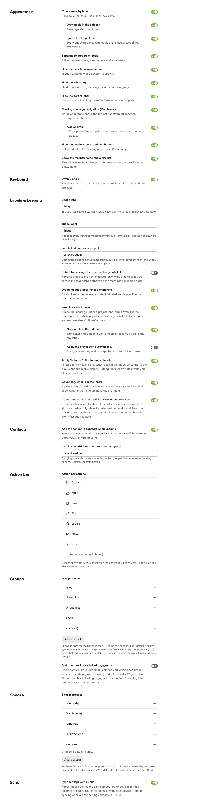

# Fastmail Custom

A personal set of tools for using Fastmail. I wanted to be able use separate apps for Personal and Work and to be able to quickly triage incoming messages (add a label in the Inbox so it feels less cluttered). That spun eh, a little out of control... :-) This repository can build Personal+Work apps on macOS + iOS + Safari extension (syncing settings between them via iCloud). It uses its own server component to deliver push notifications (requires Apple Developer account).

## Features

**Triage**

- 🏷️ **Inbox triage**: quick add a label to inbox message or archive; each decision steps on to the next message still waiting,
  or back to the list when none is left. Dragging onto a label adds it rather than moving the message, and a project
  label's list opens filtered to what is still in the Inbox
- 📦 **Keep or Archive**: keeping adds a label (also from a message's right-click menu), archiving strips all project labels/pins, and Shift-E archives into a label that holds mail rather than queues it;
  the toast after a snooze offers Keep and Archive for the same message, and the one after a keep or an archive offers Snooze, so a second decision needs no search
- 👥 **Sender to contacts**: filing under a label (keeping, or archiving into one) can add the sender to your contacts, and a specific label adds them to a Contacts group (like Hey.com)

**Grouping**

- 🗃️ **Custom groups**: build on Fastmail's "Mailbox groups" - create as many custom groups as you like, change the built-in groups
  and easily switch between them. A group can be one per top-level label or per label, and priorities (pinned, unread or any
  search) come first within every group, as sort or as extra groups; a button beside Sort (on iPhone and iPad beside the ⋯ menu above the mailbox title) collapses or expands every group at once

**Snoozing**

- ⏰ **Snooze presets and reminders**: your own list of times on Fastmail's own Snooze
  button, one whose time has passed greyed out rather than offered, and its own groups for the Snoozed
  folder, by when a conversation comes back. A message you send comes back to the
  Inbox, still in Sent, when nobody replies, at a time from a separate list of reminder presets; new messages
  and replies each have a default, changed per message with the Remind button beside Schedule send, and
  Archive on a message waiting on one removes the reminder, leaving the message in Sent. With the
  server component (see [Server/](Server/)) a reply wakes what it answers: a snoozed conversation comes back to
  the Inbox at once rather than again at its time, and a reminder is taken off. Without it the reply still
  reaches the Inbox, and the snoozed message or reminder comes back as well at its time

**User experience**

- 🪟 **Native UI (macOS) with tabs**: Fastmail runs in a WKWebView (fast, energy-efficient) and supports tabs (Command and a number
  picks one), with Fastmail's own File and View items in the menu bar
- ⌨️ **Keyboard**: E archives and Y expands (swappable back to Fastmail's default), Shift-J and Shift-K walk the sidebar, and 1, 2, 3…
  pick a snooze preset
- ✉️ **Compose inline, window or tab (macOS)**: compose messages without losing focus; new messages carry one or more labels of your choice, ticked in the Labels menu where you can untick them
- ↗️ **Pop-out windows (macOS)**: open any message or draft in its own window, which loads at once (the offline copy stays with the main window) and has the same keys and settings as the main window
- 🧰 **Action bar**: choose and order its actions, separately on phone, iPad and Mac
- 🖨️ **Printing**: print a message from its window.
- ⬇️ **Downloads**: attachments go to a folder you choose.
- 📮 **mailto handling**: mail links open in the right account on iOS (via a separate app showing a chooser).
- 🤝 **Handoff (iOS / macOS)**: carry on with the same message on your other device, or in its browser.
- 📱 **Home screen shortcuts (iOS)**: long-press the icon on iPhone or iPad for Inbox, your triage label, Compose and Search.
- 🔒 **App lock (iOS)**: iPhone and iPad can ask for Face ID, Touch ID or your passcode before mail shows.
- 🌐 **In-app browser**: links leaving the app can open in in-app browser or your default browser
- ⚙️ **Shared settings**: the same settings on Mac, iPhone and in Safari, kept in sync through iCloud when you turn that on.

**Appearance**

- 🗂️ **Grouped sidebar**: folders, labels and saved searches kept apart with sections, a label shown without its parent's
  name ("Work" instead of "Projects/Work"), and the Inbox tag left off rows where every message is in the Inbox anyway;
  on a row, plain tags come before sidebar labels and the paperclip before both
- 🔻 **Triage icon**: the triage label has its own icon
- 🔢 **Filtered counts**: counts show the number with the filter applied, and a root label can count only while collapsed
- 🎨 **Label colours**: show the full message row in the label color
- 🔠 **Mailbox title**: the mailbox's name and count in large type above the list, as on the phone, shrinking into the
  list's top row as you scroll
- 🧭 **Message navigation (iOS)**: up and down buttons floating above the tab bar, for stepping between messages one-handed

**Notifications**

- 🔔 **Notifications**: on iOS choose Off, Important, All in Inbox or labels of your own per device; a banner carries Archive, Later and Pin
  (needs the server component, see [Server/](Server/)). Custom can leave out labels too, on the Mac as well as on iOS, and a banner shows the subject above the start of the message, or the subject alone if you switch previews off (both on the Notifications page). A notification disappears from the phone once its message is read elsewhere, and the
  app icon's badge counts the Inbox or a label of your choice. On the Mac they show the sender's picture, and clicking one opens the message

**Scripting support**

- 🤖 **Shortcuts, AppleScript and the menu bar**: get URL / Title or Markdown Link via AppleScript or Shortcuts.
  Also allow running custom JavaScript to fully customize your experience, and attach Safari's Web Inspector (Inspect in the
  right-click menu and the menu bar)

## Settings



## Repository

**Fastmail Custom** (`Userscript/fastmail-custom-mode.user.js`) is the userscript
that does the work: one-label triage, where a project label is the live state
of a message and archiving means the same thing in every list. It runs on
`app.fastmail.com` and `app.beta.fastmail.com`, either through a userscript
manager or through the extension below.

**Safari extension** (`SafariExtension/`) is a small extension whose only job is
to start Fastmail Custom. Fastmail's content security policy will not run an
inline script, so a userscript manager cannot inject it there; the extension
can. It ships inside a host app, which is why it has to be installed rather
than just enabled.

**Shell apps** (`Apps/`, `Packages/FastmailShellKit/`) are native wrappers around
the web app for macOS and iOS, one per account, sharing a Swift package. They
add the things a website cannot: proper windows and tabs, a compose window,
notifications, downloads, share extensions, mailto handling, an app lock,
Handoff between devices and AppleScript support. `Apps/Mailto` is a small iOS
app that sends mailto links to whichever account you pick.

**Push server** (`Server/`) sends new-mail pushes to the iOS apps: one alert
per device for what its own notification choice asks for, everything,
important senders and VIPs, or labels you pick, reading contacts and VIPs
over JMAP so the API tokens live on the server rather than on the phone. See
`Server/README.md`.

| Path | What it is |
| --- | --- |
| `Userscript/` | Fastmail Custom itself |
| `SafariExtension/` | The extension that runs it, and its host app |
| `Apps/` | The macOS and iOS apps |
| `Extensions/` | The share extensions |
| `Packages/FastmailShellKit/` | The shared shell: web view, windows, links, settings |
| `Server/` | The push server |
| `Tests/` | Integration tests that run the real scripts in a web view |
| `tools/` | Build and deploy helpers |


## Building

You need Xcode, [XcodeGen](https://github.com/yonaskolb/XcodeGen) and Node.

```sh
cp Config/Local.xcconfig.example Config/Local.xcconfig   # then fill it in
make generate        # write the Xcode project from project.yml
make test            # package, integration and server tests, plus a syntax check
make install-macos   # build both macOS apps into /Applications
make install-ios     # install onto a paired device (DEVICE=… to choose one)
make deploy          # both of the above, everywhere: /Applications and every paired iOS device
make install-extension
```

`Config/Local.xcconfig` holds your development team, the two account
identifiers and the push server's details. It is deliberately not checked in;
the example file shows the shape.

## Not affiliated with Fastmail

This is an independent, personal project. It is **not affiliated with,
endorsed by, sponsored by, or supported by Fastmail Pty Ltd** in any way.
"Fastmail" is their name and trademark, used here only to say which service
these tools work with.

Nothing here is an official client. It changes the Fastmail web app from the
outside, so it can break whenever Fastmail changes theirs, and it comes with no
warranty of any kind. Please do not ask Fastmail for support with it; report
anything that goes wrong here instead.

## Licence

GNU Affero General Public License, version 3 or later. The full text is in
[LICENSE](LICENSE).

In short: use it, change it and pass it on, as long as what you pass on stays
under the same licence and its source stays available.
